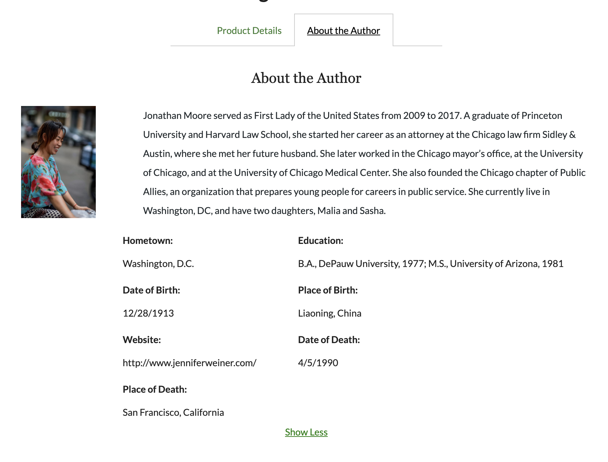
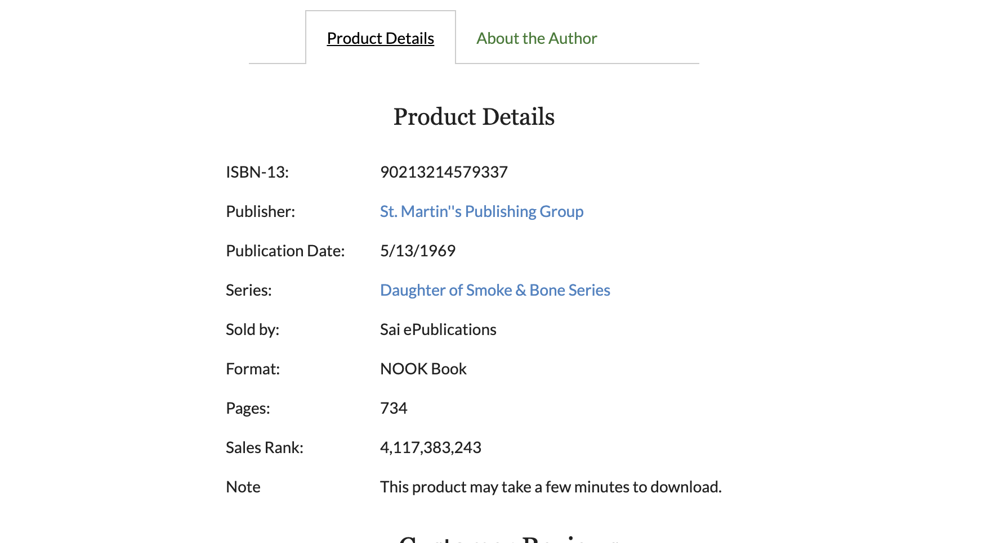

# barnesandundignifiedProductAndAuthor

## Service name: Product Details And About the Author aka 'productAndAuthor or service'.

## Description:
> This service was a part of an "item detail page" that looks a like Barnes&Noble product page: https://www.barnesandnoble.com/w/rhythm-of-war-brandon-sanderson/1136401576?ean=9780765326386 and was built during the Front End Capstone project in the Hack Reactor software engineering coding bootcamp. The page includes four significant and functionally unique modules ("widgets").
This repository contains the productAndAuthor module which is responsible for presenting a dynamic tabs view that includes details about the product and the author. This repository includes the end to end system including the MongoDB database interface, data seeding, node based server, and React based frontend.

 





## Technologies that were used: React js, MongoDb with mongoose library, Amazon EC2, Amazon S3, Express js, webpack, styled-components, enzyme.


## Getting Started:

From within the root directory run to install all the packges:

```
npm install
```

For seeding the mongoDb database run:

```
npm run seeding
```

To start webpack continous integration in development mode run:

```
npm run react-dev
```

To start the server locally on port 5001:

```
npm start
```

## Additional infromation:
Additional scripts for testing and webpack in production mode can be found in package.json in the root directory.


